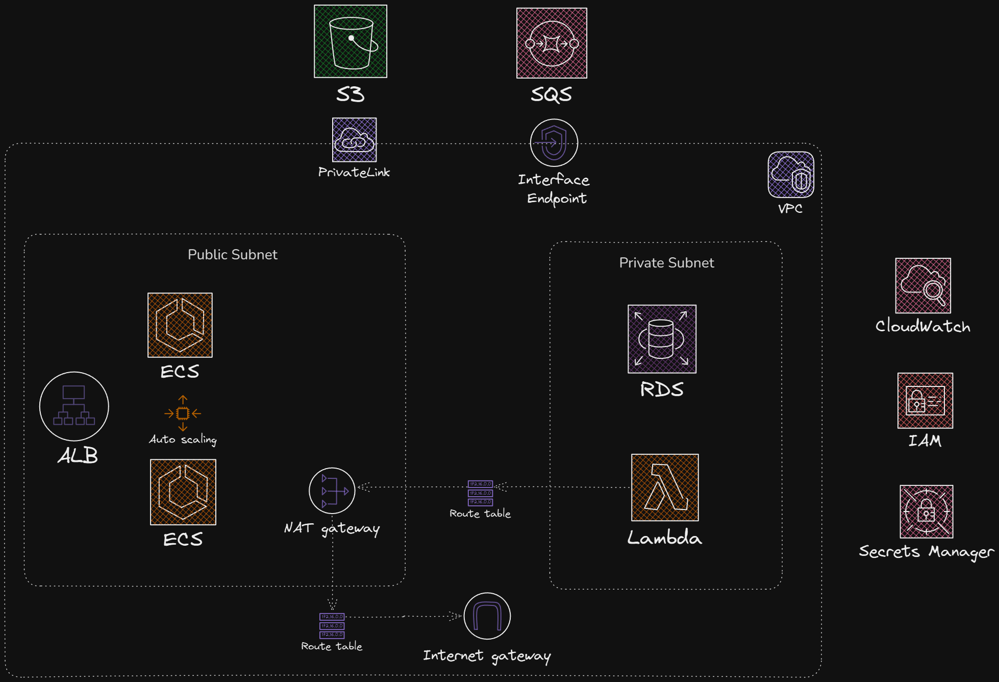

# 🤖 A platform that analyze image using AI - AWS Infrastructure ☁️
This is a mock project for practicing of building the infrastructure for a system that analyze image using AI

## 🏗️ Architecture

## 🌟 Features

- User can upload an image
- User can see the result of the analysis
- User can download the result of the analysis

## ⚙️ Technologies

| Component | Technology | Purpose |
|-----------|------------|---------|
| Load Balancer  | AWS Application Load Balancer | Distribute the traffic to the web application |
| Web Application  | AWS ECS | User interface for image upload |
| Storage   | AWS S3 | Image and result storage |
| Database  | AWS RDS | User data and analysis results |
| Message Queue  | AWS SQS | Message queue for the web application to send image and also receive the result of the analysis |
| Network  | AWS VPC | Network for the web application |
| AI Processing  | AWS Lambda | Image analysis and labeling |
| Logging  | AWS CloudWatch | Logging for the web application |
| Secret Management  | AWS Secrets Manager | Secret management for the web application |
| Role-based Access Control  | AWS IAM | Role-based access control for the web application |
| Communication between VPC and AWS Services  | AWS PrivateLink and Interface VPC Endpoint | Communication between VPC and AWS Services |

## 🔒 Security and 📊 Monitoring

- AWS IAM for authentication and authorization
- AWS Secrets Manager for secret management
- AWS CloudWatch for logging and monitoring
- AWS VPC with Public and Private Subnets
- AWS PrivateLink and Interface VPC Endpoint for secure communication between VPC and AWS Services

